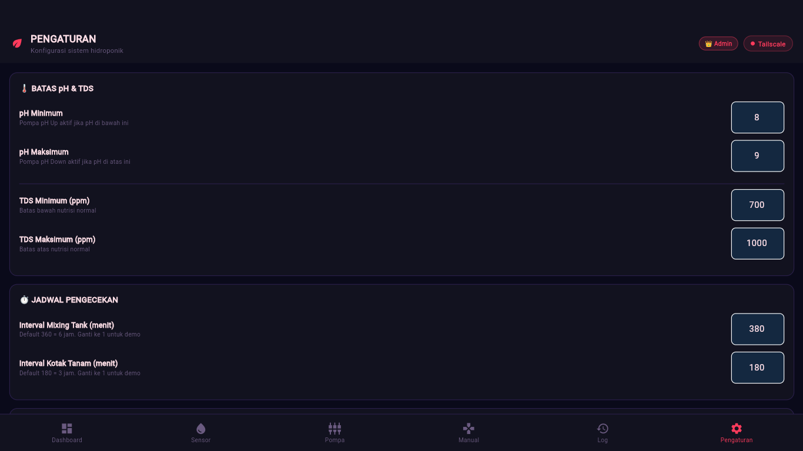
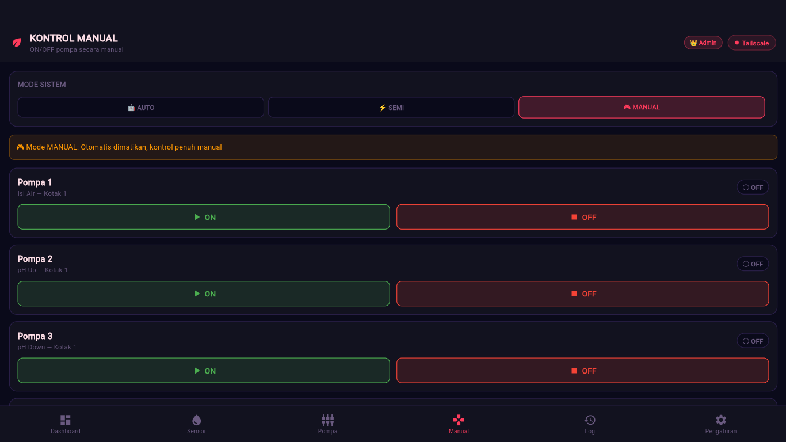
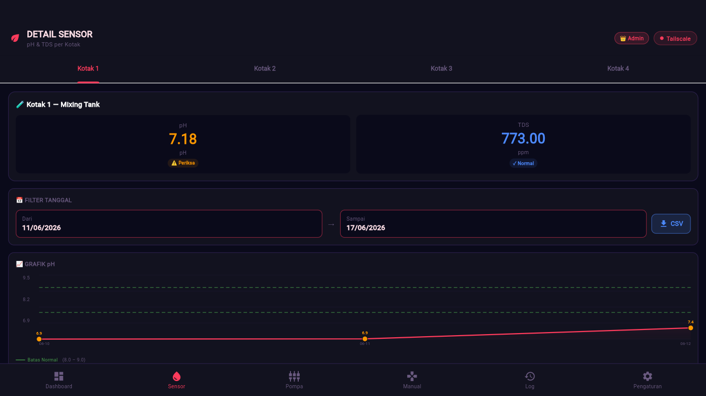

# 🌿 Hidroponik Monitor — Sistem Monitoring & Kontrol Otomatis


> Sistem monitoring dan kontrol otomatis tanaman hidroponik berbasis IoT — dari sensor hardware hingga dashboard web realtime.

**Author:** Markos Panjaitan  
**Status:** ✅ Active & Deployed

---

## 📸 Screenshot

| Dashboard | Sensor & Grafik | Kontrol Pompa |
|-----------|----------------|---------------|
|  |  |  |

---

## 🎯 Tentang Proyek

Sistem ini memantau dan mengontrol kondisi tanaman hidroponik secara otomatis. Sensor pH dan TDS membaca kondisi air secara realtime, lalu sistem memutuskan kapan pompa harus nyala untuk menjaga kondisi air tetap optimal — tanpa campur tangan manusia.

Proyek ini dibuat sebagai tugas akhir/skripsi dan sudah **di-deploy ke server nyata** dengan akses via web browser.

---

## ✨ Fitur Utama

- 📊 **Dashboard Realtime** — pantau pH, TDS, dan status pompa dari 4 kotak tanam secara live
- 📈 **Grafik Line Chart** — visualisasi tren pH dan TDS dengan garis batas normal
- 🤖 **Kontrol Otomatis** — pompa nyala/mati otomatis berdasarkan nilai sensor (mode AUTO/SEMI)
- 🎮 **Kontrol Manual** — override pompa secara manual via dashboard
- 📅 **Filter Tanggal** — lihat data historis berdasarkan rentang tanggal
- 📥 **Export CSV** — download data sensor ke file CSV
- 👑 **Multi Role** — login Admin (akses penuh) dan Tamu (hanya monitoring)
- 🔔 **Log Aktivitas** — riwayat lengkap setiap aksi pompa (auto/manual)
- ⚙️ **Pengaturan Dinamis** — ubah batas pH/TDS dan interval pengecekan dari dashboard

---

## 🏗️ Arsitektur Sistem

```
┌─────────────┐     Serial      ┌─────────────┐     WiFi/HTTP    ┌─────────────────┐
│ Arduino Mega│ ←────────────→  │    ESP32    │ ←─────────────→  │  Flask API      │
│ Sensor pH   │                 │ WiFi Module │                   │  PostgreSQL DB  │
│ Sensor TDS  │                 │             │                   │  Nginx Server   │
│ Relay 6ch   │                 │             │                   └────────┬────────┘
└─────────────┘                 └─────────────┘                            │
                                                                           │ HTTP
                                                                    ┌──────▼──────┐
                                                                    │ Flutter Web │
                                                                    │  Dashboard  │
                                                                    └─────────────┘
```

---

## 🛠️ Teknologi

### Frontend
| Teknologi | Kegunaan |
|-----------|----------|
| Flutter Web | UI dashboard monitoring |
| Dart | Bahasa pemrograman |
| CustomPainter | Line chart custom |

### Backend
| Teknologi | Kegunaan |
|-----------|----------|
| Python Flask | REST API server |
| PostgreSQL | Database penyimpanan data sensor |
| APScheduler | Penjadwalan pengecekan otomatis |
| Nginx | Web server & reverse proxy |
| Systemd | Service management |

### Hardware
| Komponen | Fungsi |
|----------|--------|
| ESP32 | WiFi gateway, kirim data ke server |
| Arduino Mega | Baca sensor, kontrol relay |
| Sensor pH | Ukur tingkat keasaman air |
| Sensor TDS | Ukur kadar nutrisi air |
| Relay 6 Channel | Kontrol 6 pompa |
| Pompa 1 | Isi air mixing tank |
| Pompa 2 | Dosing pH Up |
| Pompa 3 | Dosing pH Down |
| Pompa 4-6 | Distribusi ke kotak tanam 2, 3, 4 |

---

## 📁 Struktur Proyek

```
hidroponik-monitor/
├── flutter/
│   └── lib/
│       └── main.dart          # Seluruh UI Flutter Web
├── flask/
│   └── app.py                 # REST API + scheduler otomatis
├── arduino/
│   ├── esp32/
│   │   └── esp32.ino          # Kode WiFi gateway ESP32
│   └── mega/
│       └── mega_v4.ino        # Kode sensor + relay Arduino Mega
├── docs/
│   ├── screenshot_dashboard.png
│   ├── screenshot_sensor.png
│   └── screenshot_pompa.png
└── README.md
```

---

## 🚀 Cara Menjalankan

### Prerequisites
- Flutter SDK
- Python 3.x
- PostgreSQL
- Arduino IDE

### 1. Clone repo
```bash
git clone https://github.com/markospanjaitan/hidroponik-monitor.git
cd hidroponik-monitor
```

### 2. Setup Flask Backend
```bash
cd flask
pip install flask psycopg2 apscheduler
# Buat database PostgreSQL
# Edit konfigurasi DB di app.py
python app.py
```

### 3. Setup Flutter Frontend
```bash
cd flutter
flutter pub get
flutter run -d chrome
# atau build untuk production:
flutter build web --release
```

### 4. Upload ke Server
```bash
# Build Flutter
flutter build web --release
scp -r build/web/* user@SERVER_IP:~/web/
# Di server
sudo cp -r ~/web/* /var/www/hidroponik/
sudo systemctl restart nginx
```

---

## 📡 API Endpoints

| Method | Endpoint | Deskripsi |
|--------|----------|-----------|
| GET | `/api/health` | Cek status server |
| POST | `/api/sensor` | Kirim data sensor dari ESP32 |
| GET | `/api/sensor/latest` | Data sensor terbaru semua kotak |
| GET | `/api/sensor/history` | History sensor dengan filter tanggal |
| GET | `/api/sensor/export` | Export data ke CSV |
| GET | `/api/pompa/status` | Status semua pompa |
| POST | `/api/pompa/control` | Kontrol pompa ON/OFF |
| GET | `/api/mode` | Mode sistem saat ini |
| POST | `/api/mode` | Ganti mode AUTO/SEMI/MANUAL |
| GET | `/api/pengaturan` | Ambil konfigurasi batas pH/TDS |
| POST | `/api/pengaturan` | Simpan konfigurasi |
| GET | `/api/log` | Log aktivitas pompa |
| POST | `/api/login` | Login admin |

---

## 📊 Data & Database

Sistem menyimpan lebih dari **37.000+ data sensor** sejak deployment:

```
sensor_data    → pH, TDS per kotak setiap 5 detik (INSERT)
log_aktivitas  → riwayat setiap aksi pompa (INSERT)
pompa_status   → status terkini setiap pompa (UPDATE)
pengaturan     → konfigurasi batas pH/TDS (UPDATE)
mode_sistem    → mode AUTO/SEMI/MANUAL (INSERT)
```

---

## 🔄 Alur Kerja Otomatis

```
Setiap interval (default 6 jam):
  1. Baca pH & TDS dari sensor
  2. Bandingkan dengan batas pengaturan
  3. Jika pH < batas minimum → nyalakan Pompa 2 (pH Up)
  4. Jika pH > batas maksimum → nyalakan Pompa 3 (pH Down)
  5. Jika TDS < batas minimum → distribusi nutrisi ke kotak tanam
  6. Catat semua aksi ke log_aktivitas
  7. ESP32 polling status pompa tiap 3 detik → kirim ke Arduino Mega → kontrol relay
```

---

## 👤 Author

**Markos Panjaitan**  
📧 *[email kamu]*  
🔗 *[LinkedIn kamu]*  
🐙 GitHub: [@markospanjaitan](https://github.com/markospanjaitan)

---

## 📄 Lisensi

Proyek ini dibuat untuk keperluan tugas akhir/skripsi.  
© 2026 Markos Panjaitan. All rights reserved.
